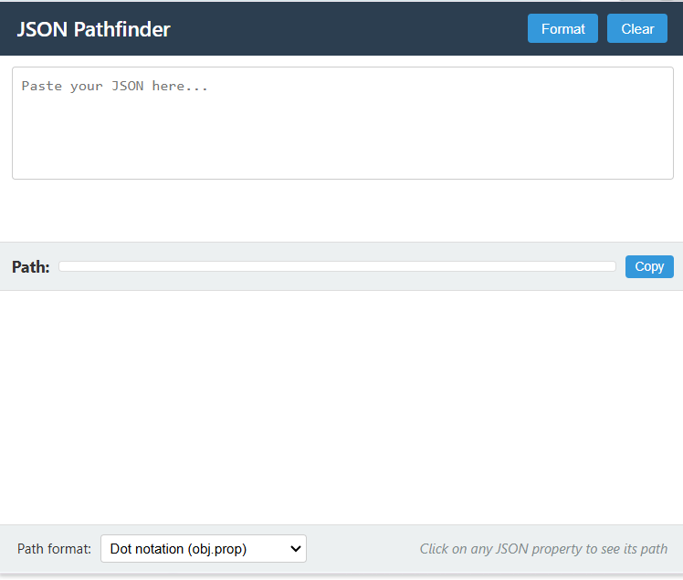

# JSON Pathfinder

<p align="center">
  
</p>

<p align="center">
  <b>Navigate through complex JSON structures with ease</b>
</p>

<p align="center">
  <a href="https://chrome.google.com/webstore/detail/json-pathfinder/[extension-id]">
    
  </a>
  
  
</p>

## 🔍 Overview

JSON Pathfinder is a lightweight Chrome extension that helps developers and data analysts work with JSON data. Instantly find paths to any property in complex JSON structures, validate your JSON, and get intelligent error feedback when there are syntax issues.

## ✨ Features

- **Interactive JSON Explorer**: Navigate through nested objects and arrays with expandable/collapsible nodes
- **One-Click Path Copying**: Click any property to see and copy its exact path
- **Multiple Path Formats**: Choose between dot notation (`data.users[0].name`) or bracket notation (`data['users'][0]['name']`)
- **Instant Validation**: Visual indicators show whether your JSON is valid or invalid
- **Smart Error Detection**: Get specific error messages and suggestions for fixing invalid JSON
- **JSON Beautification**: Format messy JSON with a single click
- **Persistent Storage**: Remembers your last used JSON input

## 🖼️ Screenshots



## 🚀 Installation

### Chrome Web Store (Recommended)
1. Visit the [Chrome Web Store](https://chrome.google.com/webstore/detail/json-pathfinder/[extension-id])
2. Click "Add to Chrome"

### Manual Installation
1. Download this repository or clone it with Git: `git clone https://github.com/isaee/json-pathfinder.git`
2. Open Chrome and navigate to `chrome://extensions/`
3. Enable "Developer mode" using the toggle in the top-right corner
4. Click "Load unpacked" and select the downloaded folder
5. The extension is now installed and will appear in your extensions toolbar

## 🛠️ How to Use

1. Click the JSON Pathfinder icon in your browser toolbar
2. Paste your JSON into the text area
3. If your JSON is valid, you'll see a green checkmark; if not, you'll see a red X with error details
4. For valid JSON, the parsed structure will appear below in a collapsible tree view
5. Click on any property to see its path
6. Use the dropdown to switch between dot and bracket notation
7. Click "Copy" to copy the path to your clipboard

## 💡 Use Cases

- **API Development**: Quickly find the exact path to specific data in API responses
- **Debugging**: Validate JSON and pinpoint syntax errors with helpful suggestions
- **Data Extraction**: Generate the correct path syntax for data processing scripts
- **Learning JSON**: Understand nested JSON structures through visual exploration

## 🔄 Upcoming Features

- JSONPath notation support
- Search functionality to find values in large JSON structures
- Dark mode theme
- Export JSON to different formats
- Custom path templates

## 🧑‍💻 Development

### Project Structure
```
json-pathfinder/
│
├── manifest.json      # Extension manifest
├── popup.html         # Main popup interface
├── popup.js           # JavaScript functionality
├── styles.css         # Styling
│
└── images/            # Extension icons
    ├── icon16.png
    ├── icon48.png
    └── icon128.png
```

### Contributing
Contributions are welcome! If you'd like to contribute:

1. Fork the repository
2. Create your feature branch (`git checkout -b feature/amazing-feature`)
3. Commit your changes (`git commit -m 'Add some amazing feature'`)
4. Push to the branch (`git push origin feature/amazing-feature`)
5. Open a Pull Request

## 📜 License

This project is licensed under the MIT License - see the [LICENSE](LICENSE) file for details.

## 🙏 Acknowledgments

- Developed by [isaee](https://github.com/isaee)
- Published by [Annus Mirabilis](https://annusmirabilis.io)

## 📞 Contact

For support, feature requests, or inquiries:
- Email: twinklegarg008@gmail.com
- GitHub Issues: [Create an issue](https://github.com/isaee/json-pathfinder/issues)
